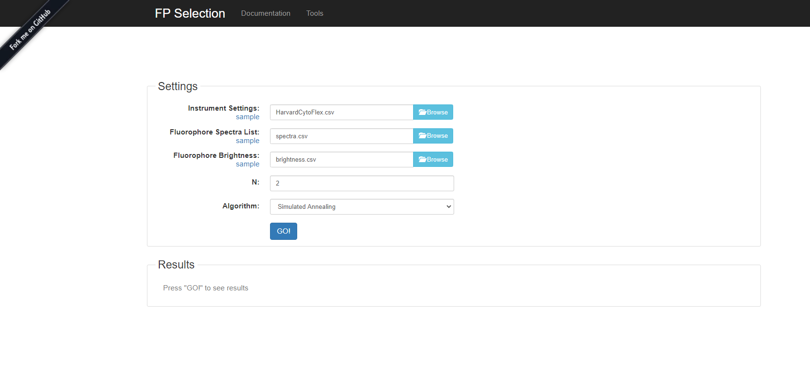

# Installing FP Selection locally.

## With Docker

#### Dependencies

* Docker 

Installation instructions for Docker can be found [here](https://docs.docker.com/engine/install/)

#### Instructions

Within the root directory of the repository (where the Dockerfile is), we will first build the docker image, and then run it, connecting the host machines' port 8080 to the docker container's port 8080.

```
docker build -t fpselection .
docker run -p 8080:8080 fpselection
```

The webapp should now be accessible from [localhost:8080](localhost:8080). You should be able to see the following screen on your browser. 




## Manual Installation

#### Dependencies
* Java 8
* Maven
* gnuplot

Java 8 and Maven can be simply installed from your package manager (apt on Ubuntu).

For gnuplot, you will be required to compile it yourself with libgd in order to get png support, which is required in this tool. You can achieve this on Ubuntu with the following commands:

```
sudo apt-get update
sudo apt-get install g++ gcc make libtool libgd-dev
wget https://sourceforge.net/projects/gnuplot/files/gnuplot/5.2.8/gnuplot-5.2.8.tar.gz/download -O gn
uplot-5.2.8.tar.gz
tar -xvf gnuplot-5.2.8.tar.gz
cd gnuplot-5.2.8 && ./configure
sudo make install
```

#### Instructions

Starting from the root package directory, we will install the fpSelection library and install it to the local maven repository. Then we will go to the webapp and start a local jetty web server.
```
cd fpSelection/
mvn clean install
cd ../fpSelectionWebApp
mvn jetty:run
```

The webapp should now be accessible from localhost:8080.


### Development

When developing, follow the manual instructions. Please also make sure to verify dependencies and tests to ensure there are no issues with the build definition before submitting a pull request.

e.g.
```
cd fpSelection/
mvn clean dependency:resolve verify install
cd ../fpSelection
mvn clean dependency:resolve verify jetty:run
```
